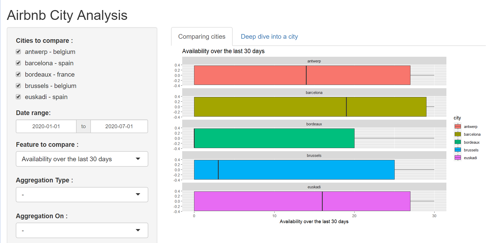

Presentation of Airbnb Project
========================================================
author: Maxime Billette - Artemii Lazovskii - Amir Messedi
date: 26/11/2020
autosize: true

Presentation of the App
========================================================

The following presentation describe what we gathered as data from the Airbnb API. We provide a web application that shows the differences between the rents of each city

The data were collected from January, the 1st of 2020, to July, the 1st of 2020, and they include cities from France, Spain and Belgium.

What we can plot
========================================================

What we can plot
========================================================

What we can modify
========================================================

What we can modify
========================================================

## The features

  * The revenue (in dollars) generated over the last 30 days
  * The availability (in days) over the last 30 days
  * The price (in dollars) of the rent
  
What we can modify
========================================================

## The Aggregation type

  * The room type
  * The number of bedrooms
  * The neighbourhood
  
What we can modify
========================================================

## The Aggregation on

  * Total count
  * Average
  * Median
  
What we can modify
========================================================

## The Plot types

  * Boxplot
  * Histogram
  * Barplot
  * Circle
