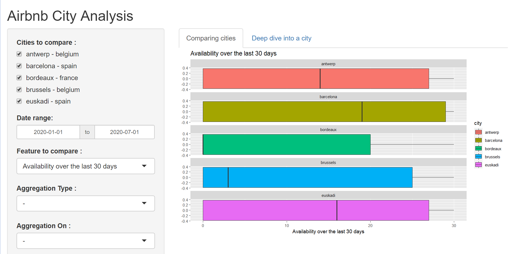
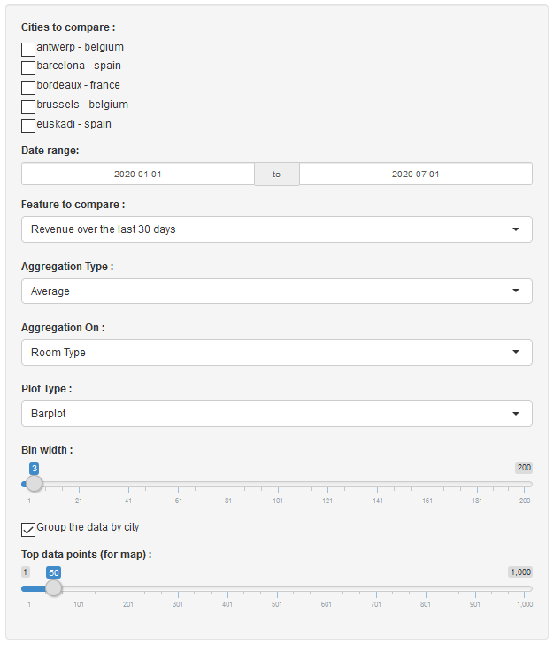

---- 

## Presentation of the App

The following presentation describe how to use the Shiny App that helps you analyze the data over the renting for each city in France, Spain and Belgium, given by the Airbnb REST API. The data were collected from January, the 1st of 2020, to July, the 1st of 2020.

----

## Getting started

To launch the online version of the app, just go to your favorite web browser and paste the following link :

```
   https://maxime-billette.shinyapps.io/project_airbnb/
```

The data here is already pre-processed. Let's dive into the functionalities you might use. You should be able to have something like this in the end :



The first thing you have noticed is that you have two tabs, one is for comparing cities and is displayed only if you selected multiple cities, and one is for a deeper view inside a single city, with the addition of a map with the data points.

The list of parameters you can tune is indicated on the left panel. Here is a review of what you can modify :



### Cities to compare

The App looks for the data in real time, so you might wait for the data to be loaded before being able to select the cities you would like to compare. When it is loaded, you just have to check the cities for comparison.


### Date Range

You can select the range of date for the data collection. It goes from January, the 1st of 2020, to July, the 1st of 2020, but you can shrink it as you like.

### Feature to compare

This is the core of the project. You can change the feature you would like to compare amoung the following ones :

  * The revenue (in dollars) generated over the last 30 days
  * The availability (in days) over the last 30 days
  * The price (in dollars) of the rent
  
### Aggregation Type and On

If you wish to have a closer look to the comparison, you can add levels of details with the aggregation. You can chose amoung the following columns for your aggregation :

  * The room type
  * The number of bedrooms
  * The neighbourhood
  
In addition, you can make your aggregation with the types :
  
  * Total count
  * Average
  * Median
  
### Plot Type

You are free to use the plot type you think is the most adapted to your study, with the parameters you would like to set to your histogram (with the bin width cursor)

The available plot types are :

  * Boxplot (**works only for plots that do not contain aggregations**)
  * Histogram
  * Barplot
  * Circle
  
### Group by city

You can use this checkbox to pack or unpack the data for each city, as you want to display the informations on one facet or multiple facets.

### Top data points (for map)

This range selector indicate the number of the best data points you would like to print, based on the feature you have selected

----

## How to build your own *on-premice* version

### Preprocess

If you want to build your own application, you have to modify the preprocess.R script so that the variable ```selectedCountries``` corresponds to your desired ones, amoung the choices that are :

  * France
  * Spain
  * Italy
  * Germany
  * Netherlands
  * Belgium
  
Then, modify the ```min_date``` and ```max_date``` in both the preprocess script and the Shiny app to correspond to your range of date you like.

### Change the parameters

If you prefer to change the values, the system of plotting and the global interface, feel free to change it to your heart's content. You can also change the .csv file to collect more data from the Airbnb API.
